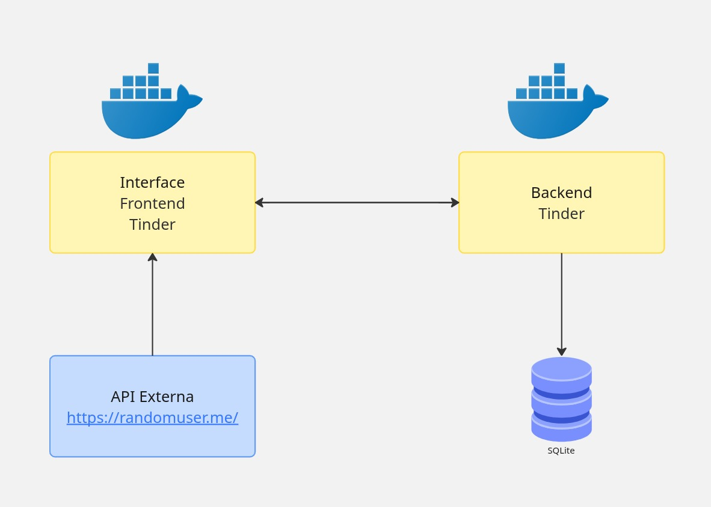

# Projeto: Tinder Style - Frontend

Este projeto frontend é uma aplicação estilo "Tinder", desenvolvida para simular a experiência de curtir ou rejeitar perfis de pessoas de forma dinâmica e interativa. Os perfis são gerados automaticamente por meio da API pública RandomUser.me (https://randomuser.me), garantindo uma variedade de dados fictícios com nacionalidade brasileira.

A cada interação (👍 ou 👎), o perfil visualizado é enviado para uma API Backend (https://github.com/wesleymininel/backend-tinder/), que registra e persiste o histórico dessas ações em um banco de dados SQLite.

O sistema também exibe uma tabela de histórico com todos os perfis já interagidos, permitindo visualização dos dados armazenados, edição do campo "like" diretamente na tabela e remoção de perfis do histórico.

---

## 👩‍💻 Como executar com Docker

Certifique-se de que o Docker está instalado em seu sistema.

1. **Clone o repositório**:
   ```sh
   git clone https://github.com/wesleymininel/frontend-tinder.git
   ```
   
2. **Navegue até o diretório do backend**:
   ```sh
   cd frontend-tinder
   ```

3. **Construa a imagem Docker**:
   ```sh
   sudo docker build -t frontend-tinder .
   ```

4. **Execute o contêiner**:
   ```sh
   sudo docker run -p 8080:80 frontend-tinder
   ```
A aplicação estará disponível em http://localhost:8080.

---

## 🚀 Funcionalidades

- Buscar perfis aleatórios na API [https://randomuser.me](https://randomuser.me) com nacionalidade brasileira
- Curtir (👍) ou rejeitar (👎) perfis
- Visualizar e editar histórico de perfis interagidos
- Atualizar o status de "like" diretamente na tabela de histórico
- Remover registros do histórico

---

## 🔍 Tecnologias Utilizadas

- **HTML5**
- **CSS3**
- **JavaScript**
- **Docker**

---

## 📱 Estrutura de Pastas

```bash
frontend-tinder/
├── src/
│   ├── index.html
│   ├── style.css
│   ├── script.js
├── Dockerfile
├── README.md
└── diagrama.jpg
```

---

## 🌎 API Externa Utilizada

### Random User API - [https://randomuser.me/](https://randomuser.me/api/?nat=br)

- Fornece dados de perfis aleatórios do Brasil
- Utilizado no carregamento de novos perfis

---

## 📊 Endpoints da API Backend Flask

- **POST /addhistorico**  
  Adiciona um perfil ao histórico.

- **GET /listhistoricos**  
  Retorna todos os perfis salvos.

- **DELETE /delhistorico?firstname=...**  
  Remove um perfil com base no primeiro nome.

- **PUT /edithistorico**  
  Atualiza o campo "like" de um perfil.

---

## 🖋️ Interface Frontend

A interface é composta por duas seções principais:

1. **Cartão do Perfil Atual:**
   - Exibe imagem, nome, idade, gênero e estado
   - Botões de like/dislike com 👍 e 👎

2. **Tabela de Histórico:**
   - Mostra todos os perfis já interagidos
   - Permite excluir registros ou atualizar o like

---

## 📈 Diagrama do Cenário



---

## 🤝 Contribuição

Contribuições são bem-vindas! Para contribuir, siga os passos abaixo:​

 - Faça um fork do projeto.​
 - Crie uma branch para sua feature (git checkout -b feature/nova-feature).​
 - Commit suas alterações (git commit -m 'Adiciona nova feature').​
 - Faça o push para a branch (git push origin feature/nova-feature).​
 - Abra um Pull Request.​

---

## 📄 Licença

Este projeto está licenciado sob a licença MIT. Veja o arquivo LICENSE para mais detalhes.​

---

## 📫 Contato

Para mais informações, entre em contato:

 - Email: wesley.mininel@gmail.com
 - GitHub: wesleymininel


